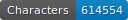
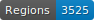
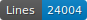
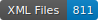

# HTR-SETAF-Jean-Michel

Ce dépôt contient les données OCR des ouvrages publiés par Jean Michel, maître-imprimeur à Genève de 1538 à 1544 qui rachète le matériel typographique de Pierre de Vingle. Les textes sont des imprimés français du XVIe siècle en caractères gothiques et la liste des textes avec plus de détails se trouve dans le tableau CSV du dépôt.

Les ouvrages imprimés par J. Michel et attribués au poète réformé M. Malingre (c.1500-1572) se trouvent également dans le dépôt suivant : https://github.com/SETAFDH/OCR-Malingre. 

L'édition des *Faits de Jésus Christ et du pape* imprimée par J. Michel se trouve dans le dépôt suivant: https://github.com/SETAFDH/HTR-SETAF-LesFaictzJCH.

   


## Projet SETAF

GitHub du projet : https://github.com/SETAFDH 

Site du projet : https://www.unige.ch/setaf


## Financeur

Ce projet est financé par le Fonds national suisse (FNS). Numéro de projet : 205056 (https://data.snf.ch/grants/grant/205056).


## Données

Les données se trouvent au chemin ‘./data//.xml‘ et sont au format ALTO. Elles suivent les normes de segmentation SegmOnto (https://segmonto.github.io) et sont cataloguées sur HTR-United (https://htr-united.github.io). Les fichiers sont corrigés manuellement : la qualité de la segmentation des pages et de la transcription produite par l'OCR est indiqué dans le tableau CSV du dépôt ("gold" ou "en cours").

Le contrôle de la transcription produite par l'OCR se base sur un guide redigé par l'équipe du projet : Solfrini et al., Guide de transcription pour les imprimés français du XVIe siècle en caractères gothiques, Version A, 2023, https://hal.science/hal-04281804.


## Infrastructure

Les données pour l'HTR sont produites à l'aide de l’instance genevoise FoNDUE (https://www.unige.ch/lettres/humanites-numeriques/recherche/projets-de-la-chaire/fondue) d'eScriptorium (https://gitlab.com/scripta/escriptorium).


## Licence

Les transcriptions sont [CC-BY](https://creativecommons.org/licenses/by/4.0), et les images suivent les règles de différentes bibliothèques numériques :
- e-rara : https://www.e-rara.ch/wiki/termsOfUse?lang=en
- Österreichische Nationalbibliothek : https://www.onb.ac.at/en/use


## Citer le dépôt

- Version `1.0`: Sonia Solfrini, Geneviève Gross, Pierre-Olivier Beaulnes, Aurélia Marques Oliveira, Simon Gabay et Daniela Solfaroli Camillocci, _Données OCR et segmentation des imprimés de Jean Michel (projet SETAF)_, version `1.0`, Genève, université de Genève, 2023, https://github.com/SETAFDH/HTR-SETAF-Jean-Michel.

```bibtex
@misc{solfrini_MichelSETAF_2023,
  author={Solfrini, Sonia and Gross, Geneviève and Beaulnes, Pierre-Olivier and Marques Oliveira, Aurélia, and Gabay, Simon and Solfaroli Camillocci, Daniela},
  title={Données OCR et segmentation des imprimés de Jean Michel (projet SETAF)},
  version={1.0},
  address={Genève},
  publisher={université de Genève},
  year={2023},
  url={https://github.com/SETAFDH/HTR-SETAF-Jean-Michel},
}
```

## Citer le projet

Sonia Solfrini, Geneviève Gross, Brigitte Roux, Nathalie Szczech et Daniela Solfaroli Camillocci, _SETAF (S’en tenir aux 'Faits de Jésus Christ et du pape'). Les imprimés évangéliques romands et les pratiques de communication religieuse à l’époque de la Réforme_, Genève, université de Genève, 2023, https://www.unige.ch/setaf.

```bibtex
@misc{solfrini_SETAF_2023,
  author={Solfrini, Sonia and Gross, Geneviève and Roux, Brigitte and Szczech, Nathalie and Solfaroli Camillocci, Daniela},
  title={SETAF (S’en tenir aux 'Faits de Jésus Christ et du pape'). Les imprimés évangéliques romands et les pratiques de communication religieuse à l’époque de la Réforme},
  address={Genève},
  publisher={université de Genève},
  year={2023},
  url={https://www.unige.ch/setaf},
  note={numéro de projet FNS : 205056},
}
```
